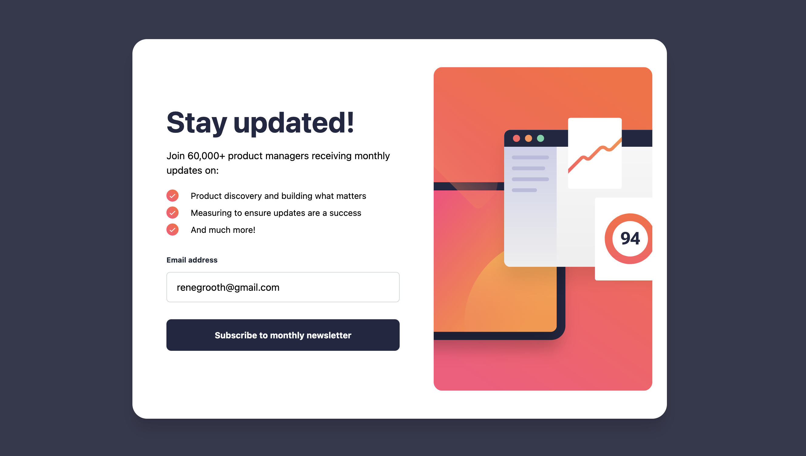

# Frontend Mentor - Newsletter sign-up form with success message solution

This is a solution to the [Newsletter sign-up form with success message challenge on Frontend Mentor](https://www.frontendmentor.io/challenges/newsletter-signup-form-with-success-message-3FC1AZbNrv). Frontend Mentor challenges help you improve your coding skills by building realistic projects. 

## Table of contents

- [Overview](#overview)
  - [The challenge](#the-challenge)
  - [Screenshot](#screenshot)
  - [Links](#links)
- [My process](#my-process)
  - [Built with](#built-with)
  - [What I learned](#what-i-learned)
  - [Continued development](#continued-development)
- [Author](#author)

## Overview

### The challenge

Users should be able to:

- Add their email and submit the form
- See a success message with their email after successfully submitting the form
- See form validation messages if:
  - The field is left empty
  - The email address is not formatted correctly
- View the optimal layout for the interface depending on their device's screen size
- See hover and focus states for all interactive elements on the page

### Screenshot

### Links

- Solution URL: [Github](https://github.com/pulsarbeam/First-challenfe)
- Live Site URL: [Live site (Vercel)](https://first-challenfe.vercel.app/)

## My process

### Built with

- React
- TailwindCSS
- Flexbox
- CSS Grid
- Mobile-first workflow
- [React](https://reactjs.org/) - JS library

### What I learned

During my first frontend challenge I learnt a lot about responsive design, Learning to use tailwindCSS mobile-first approach was key in making the site responsive, Also learning to render out different components based on a form being valid or not was nice to learn without routing things to other pages.

Using email regex was a first for me and it was cool to do my own form validation instead of using the built in one makes a cleaner and more professional design, 

Overall I am very happy with how this turned out I know its not perfect but I enjoyed this challenege and will do more!

### Continued development

I want to refine my mobile-first approach I realised after making the desktop version it was quite tricky to make it mobile responsive as well so next time I want to try make the code cleaner I think I could cut down on a lot of css, 

Being smarter about my flex and grid would also be nice I learnt a lot in  this project but I think I can do better for the next challenge

## Author

- Website - [Rene Groothuis](https://pulsarbeam.github.io/personal-website/)
- Frontend Mentor - [@pulsarbeam](https://www.frontendmentor.io/profile/pulsarbeam)

